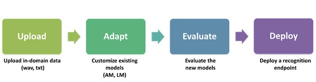
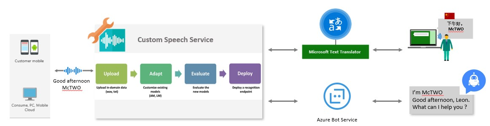

# Improve the result of Speech translation and Speech Recognition by Custom Speech Service

## Background：
Voice is the new interface driving ambient computing. This statement has never been more true than it is today. Speech recognition is transforming our daily lives from digital assistants, dictation of emails and documents, to transcriptions of lectures and meetings. Besides voice command, bot with speech interaction, some companies also use speech translator to translate from one language to other languages in internal IT services, system, marketing events and customer service etc. However, in some industries, especially manufacturing industry, many domain specific vocabularies and abbreviations are often used with complex acoustic conditions. In these situations, general speech recognition and speech translator services aren’t able to meet the requirement of accuracy. As a result, the user, Bot or some smart assistant services hardly understand the exact meaning of what the speaker said from the recognized text, and translated text by Bing translator. In the worst cases, it may cause some mistakes, error operating, or misunderstanding.

## Solution: 
To meet the various requirements of speech recognition and speech translator in voice-enabled app in IT system, Bot, IoT Edge devices etc.,  we can use Azure Cognitive Service - Custom Speech Service to build customized speech module with specific training and testing data, and deploy the module. After that, use Microsoft Translator to translate the texts  recognized by custom module to improve the accuracy. Please kindly the detail steps as follow: 

### 1.	Build Customized Speech Module with Custom Speech Service
Custom Speech Service enables acoustic and language model adaptation with zero coding in the portal. 
-	Use Custom Speech portal  for data import, model adaptation, evaluation and optimization through measuring word error rate and tracking improvements. 
-	After testing in the portal, we can easily deploy the model at scale. 
-	Use the rest API with Custom Speech service key and Deployment ID to access the service. 

 

Please refer to the guidance of using Custom Speech Service both in English and Chinese Language  https://github.com/leonlj/CustomSpeechExample 

### 2.	Use Microsoft Text Translator to translate the texts recognized by custom module to other language
Please refer to Text Translator https://azure.microsoft.com/en-us/services/cognitive-services/translator-text-api/  

### 3.	Test the result by using custom speech + Microsoft translator demo app
There are open sourced Windows UWP App to show  and test how we can use Custom Speech Model and Microsoft Translator to improve the Speech translation result for specific vocabularies and acoustic conditions. 
https://github.com/leonlj/CustomSpeechWithMicrosoftTranslator 

